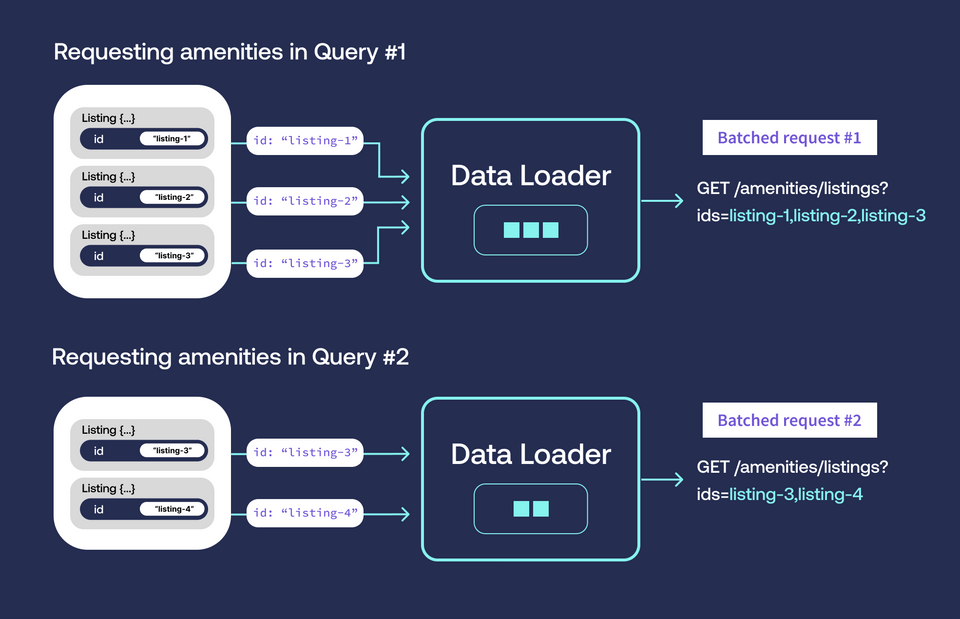

# (Odyssey Course) Intro to GraphQL with TypeScript and Dataloaders

Welcome to the starter code for **Intro to GraphQL with TypeScript**. You can find the [course lessons and instructions](https://apollographql.com/tutorials/intro-typescript) on Odyssey, [Apollo](https://apollographql.com)'s learning platform.

## How to use this repo

The course will walk you step by step on what to do. This codebase is the starting point of your journey!

Navigate to the root of the project directory, and run the following commands.

```
npm install && npm run dev
```

The `final` branch of this repo contains the final stage of the course, with all of the steps and code completed! If you get stuck, you can refer to it and compare your code.

## Getting help

This repo is _not regularly monitored_.

For any issues or problems concerning the course content, please refer to the [Odyssey topic in our community forums](https://community.apollographql.com/tags/c/help/6/odyssey). You can also [join the Apollo Discord](https://discord.gg/graphos).


## Reference documentation

For further reference, please consider the following sections:

* [Official TypeScript documentation](https://www.typescriptlang.org/docs/)


## NOTES:
- The n+1 problem occurs when we make an initial request, followed by some unknown number of follow-up requests.

### Dataloaders
- A data loader's primary job is to replace multiple similar requests with a single batched request

- In the process of resolving a query, our resolver might call the data loader `n` times, passing it `n` keys. 
- The data loader groups them together into one list (`["listing-1", "listing-2", "listing-3"]`), then calls the `GET /amenities/listings` with them.
- Data loader method will automatically deduplicate the identifiers we pass them. This means if our query included multiple listings with the same ID, we'll only request the listing's amenities once.
- What does dataloader expect back? Well, it put in a list of `n` keys; it expects a list of no more than three objects back!

- > Note: The data loader also expects each object returned to align with the position of its corresponding key in the original request. For instance, if "listing-1" was sent as the first key, its list of amenities should be the first object in the response!

- From there, the data loader handles the logic of mapping each list of amenities back to the key that requested it.


- > NOTE: Data loaders and the set of keys they process at any one time should be limited to a single request
 
